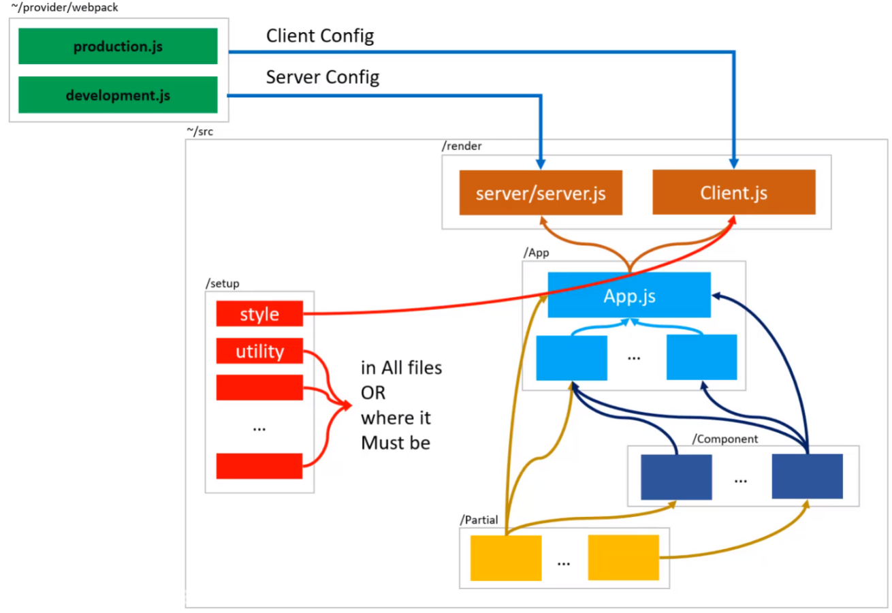

# RSSR

# Rule

## Camel case
Camel case is the practice of writing phrases such that each word or abbreviation in the middle of the phrase begins with a capital letter, with no intervening spaces or punctuation. Common examples include "iPhone" and "eBay".

### `Note:` We use camcel case to name file and directory in RSSR
### `Note:` Component style file must be named as camel case in RSSR

## Pascal Case
PascalCase is a naming convention in which the first letter of each word in a compound word is capitalized

### `Note:` Component file must be named as pascal case in RSSR

# Tech Stack

Here's a curated list of packages that you should be at least familiar with before starting your awesome project. However, the best way to see a complete list of the dependencies is to check `package.json`

### Core

- [ ] [React](https://facebook.github.io/react/)
- [ ] [Trim-Redux](https://github.com/ebrahimiaval/trim-redux#readme)
- [ ] [Express](https://expressjs.com/)

### Linting

- [ ] [ESLint](http://eslint.org/)

## Project Structure

### `provider/`
This is our starting point, which includes basic settings.
- `provider/server`: As the name suggests, this folder contains development and production server configuration.
    - [`development.js`](./development.js.md): contain development configuration
    - [`production.js`](./production.js.md): contain production configuration

- `provider/webpack`: This folder contains webpack configuration 

- `provider/setup`:Contains methods and additional operations of the provider section 

### `public/`
Here is where all the static files are stored.

### `src/`
This is the body of our application.
- `src/App`:
- `src/Component`:
- `src/Partioal`:
- `src/render`:
   - `Server` 
   - `Template` 
   - `client.js` 
- `src/setup`:
     - `Style`: this directory contains public styles.
     - `Utility`: this directory contains public javascript functions.
     - `Constant.js`: Here are constants.
     - `loacalStorage.js`: There are some datas that I went to set to browser's local storage at initial loading. 
     - `Store.js`: There are the initial state and configs about [`Trim-Redux`](../js/trim-redux.md) .

## Relationships Between directories

### `.bablere, eslintre, .env ...` : 
There are Bable confige, ESlint confige, environment variable and ... .

# RSSR Directory
There are two kind of directory in RSSR.
- [Entity Directory](#entity-directory)
- [Wrap Directory](#wrap-directory)

## Entity Directory
An entity directory is any singular, identifiable and separate directory and grow subcomponent like tree structure. ex: home.js, about.js etc.

## Wrap Directory
It doesn't have Entity directory and isolated with their behvior, in fact to make project readable, they can hold different entity inside.

### `Note:` Wrap directory can be chaining like partial, component folder can be connected togather inside like graph structure

## Special Directory
- [ `__style` Directory](#style-directory)
- [ `__action` Directory](#action-directory)
- [ `__component` Directory](#component-directory)

### `Note:` Two underline give an alert, there is a special case

##  __style Directory: 
`__style` directory used when two component has common style. it solve this rare issues by creating `__style` in the first parent of that directory to handle duplicate style.

## `__action` Directory:
`__action` directory used when two component has common action. create `__action` in the first parent of that directory to handle duplicate action.

## `__Component` Directory:
`__Component` is used when a component is same in multiple container, we can solve the issue by creating `__Component` in the first parent of that directory to handle duplicate component.

## Expansion of Entity

| **_Musts_**         | **_Exceptions_**    | 
| -------------|-------------|
| 1-Every entity in the App,Component and Partial must have a directory      | App.js file in the App folder | 
| 2-Any entity with more than one file must be defined as a Entity Directory(Modular tree structure)     | Except for the js and css file until it doesn't reduce the readability of the project but also helps it      |
| 3-The set of files and entities that have a specific definition must be defined as a Wrap Directory | Except for cases that include Entity Directory conditions      |

## Basic Building Blocks

### `TrimRedux`

trim-redux is a tool for work simplify with the Redux in Reactjs. trim-redux removed reducer, combineReducer and action in redux usage process
and let you work with redux like react component state!
